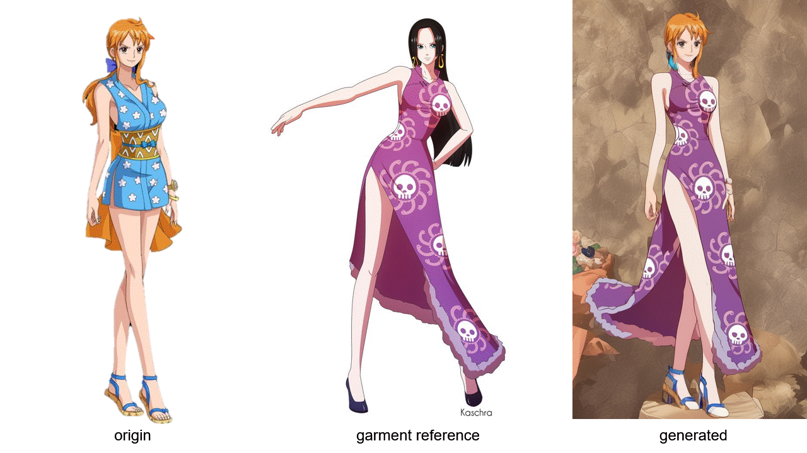
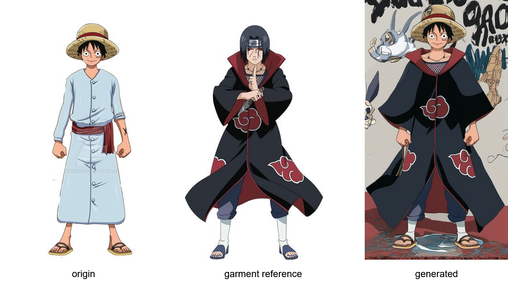

# Outfit Anyone
**
News**: Now you can try out OutfitAnyone v0.9 on <a href = "https://modelscope.cn/studios/DAMOXR/OutfitAnyone">ModelScope 魔搭</a> ( for Chinese users ) . Enjoy it and have fun!

**News:**
The experience demo of OutfitAnyone v0.9 is now available on <a href = 'https://huggingface.co/spaces/HumanAIGC/OutfitAnyone' >Hugging Face</a>.

 
To prevent the malicious use of personal photos, we have currently limited our feature to only allow the upload of clothing images. All models displayed are pre-set and generated using our AI model to ensure safety and privacy.

[//]: # (Feel free to enjoy OutfitAnyone, and we encourage you to share your interesting results with us.)
Feel free to enjoy OutfitAnyone and share your interesting results with us. If you have any questions or suggestions, don't hesitate to leave a message in the issues section.

**Note: Please don't forget to give us a star if you like this project. Thanks!** :stuck_out_tongue_winking_eye:

---

[//]: # (~~**A demo that can be experienced is being prepared.**~~)

Outfit Anyone: Ultra-high quality virtual try-on for Any Clothing and Any Person

Institute for Intelligent Computing, Alibaba Group

  

OutfitAnyone+AnimateAnyone: 

